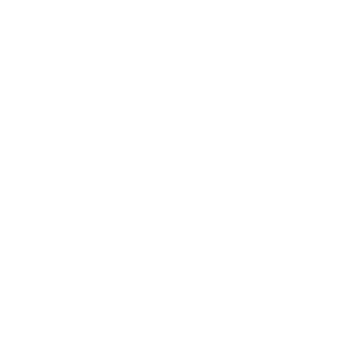
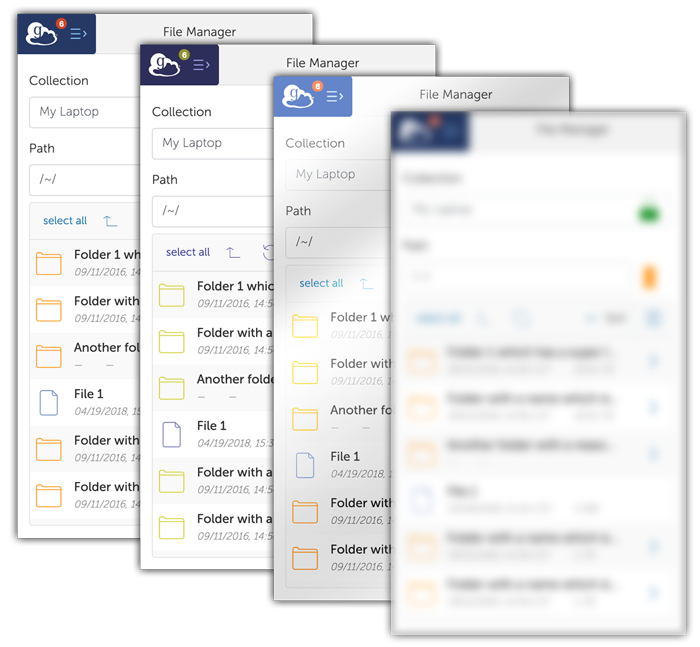

@snap[west span-80]
# Accessibility and Globus
@snapend

@snap[east span-20]

@snapend

---

## What is "web accessibility"?

Web accessibility means that websites, tools, and technologies are designed and developed so that people with disabilities can use them equally.

Note:
- like a deaf user being able to understand content in a video because it has captions

---

## Web accessibility benefits everyone!

@ul[spaced](false)

- captions in loud environments
- good color contrast in bright environments with glare

@ulend

Note:
- those same captions might be helpful when you're in a cafe or shared office space
- or being able to see text on your phone outside when there's a glare because there is good color contrast

---

### How do people with disabilities experience the web?

@css[small](https://www.w3.org/WAI/perspective-videos/)

---
@snap[north-west]
## Standards
@snapend

The @css[highlight](W3C) (World Wide Web Consortium) provides standards to help make the web accessible.

These standards are known as the @css[highlight](WCAG) (Web Content Accessibility Guidelines) and are internationally recognized by governments and businesses.

Note:
- 
---

@snap[north-west]
### Standards (continued)
@snapend

The standards are broken up into 4 principles with the acronym "@css[highlight](POUR)"

@ul
- @css[highlight](P) - Perceivable
- @css[highlight](O) - Operable
- @css[highlight](U) - Understandable
- @css[highlight](R) - Robust
@ulend

---

@snap[north-west]
### Standards (continued)
@snapend

@snap[west span-50]
### Perceivable

- text alternatives for non-text content
- captions and other alternatives for multimedia
- content can be presented in different ways
- content is easier to see and hear

@snapend

@snap[east span-50]

@snapend
Note:
In short, the content needs to be presented in different ways: text alternatives for images that are read by screen reader users, captions for those with hearing impairment, good color contrast for those with low vision
---

@snap[north-west]
### Standards (continued)
@snapend

## Operable

- functionality is available from a keyboard
- users have enough time to read and use the content
- content does not cause seizures or physical reactions
- users can easily navigate, find content, and determine where they are
- make it easier to use inputs other than keyboard

Note:
- Can users who don't have a mouse interact with all the same components like buttons and inputs
- Does a user have enough time to read error or success messages?
- it means making sure the content doesn't cause seizures like with flashing animations
- and making sure everything is organized so navigating and finding content is intuitive
- it also means allowing users to use inputs like speech to text
---

@snap[north-east]
WCAG 2.0 Standards
@snapend

## Understandable

- text is readable and understandable
- content appears and operates in preditable ways
- users are helped to avoid and correct mistakes

Note:
- Is the font easy to read? Can text be resized? Does it make sense?
- Does the content appear and operate in a predictable way?
- Are users helped to avoid and correct mistakes? like a helpful error message if their file name is invalid
---

@snap[north-east]
WCAG 2.0 Standards
@snapend

## Robust content and reliable interpretation

- content is compatible with current and future user tools

---

@snap[north-east]
WCAG 2.0 Standards
@snapend

The standards are also broken up into 3 different levels:

@ul
- @css[highlight](A) - Bare minimum
- @css[highlight](AA) - Good and meets requirements for ADA laws
- @css[highlight](AAA) - Rockstar (and rare)
@ulend

@box[fragment](Note: WCAG 2.1 June 2018 adds additional criteria)

Note:
- version 2.1 of the WCAG came out last year which adds criteria for newer concepts like responsive design and device orientation
- most accessible sites adhere to 2.0

---

## How do we make Globus accessible?

---

### Education across front-end & testing teams

@ul
- designing for accessibility
- writing semantic HTML that is accessible
- making our content easy to understand
- making components and content present & behave predictably
- testing for accessibility throughout development
@ulend

Note:
- The first step is....
---

### Auditing and testing for compliance

---

@snap[west span-10]

@snapend

@snap[east text-left span-90]
Accessibility Insights for Web
@snapend

---

- automated testing
- manual testing assistance
- reports

Note:
- The second step is....
- One of the things I've been working on is creating a standard operating procedure to find & fix current accessibility issues
- There are many plugins and tools that developers can use to test the accessibility of websites
- reports, which we can use as a reference to create our github issues
---

## Resources
